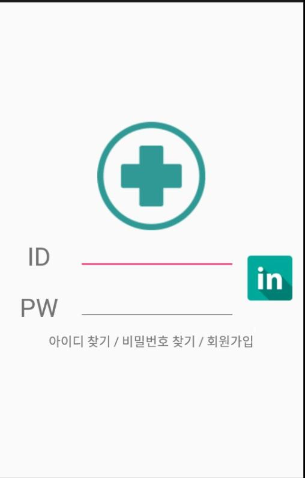
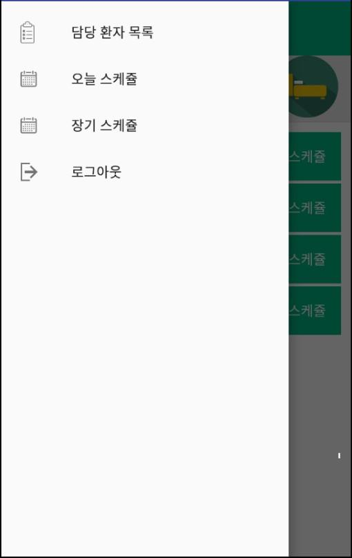

##NurseTask

병원내에서 사용할수 있도록 커뮤니티기능, 스케쥴 부여 및 확인기능, 환자 상태 기능, 담당환자 부여 및 조회기능이 있는 어플

android(java) firebase-cloudmessaing(서버와 연결) alarmmanager service

기능 - 공통
* 로그인 로그아웃
* 병동에 따른 환자 조회
* 채팅
* 채팅, 스케쥴, 담당환자, 환자 정보 변경 시 알람기능

기능 - 관리자
* 간호사 별 스케쥴 장기, 단기 부여
* 간호사 별 담당환자 부여
* 환자 수정 삭제 추가

기능 - 일반 간호사
* 자신의 장기 단기 스케쥴 조회
* 자신의 담당환자 조회

   

   

   

